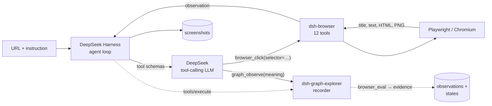

# WebTestAgent

**Point a DeepSeek Harness agent at a URL with a plain-English instruction; it drives a real
browser and reports back.**

This repo is the thin host layer for agentic web testing on top of
[DeepSeek Harness](https://www.npmjs.com/package/@deepseek-ai/dsh). It ships no browser code
of its own: the browser is the third-party **`dsh-browser`** bundle, wired into DSH profiles.
What this repo owns is the configuration around it, the one piece of tooling `dsh-browser`
cannot provide for itself, and a demo app worth pointing a run at.



> **The browser plugin this repo used to ship was retired.** See
> [Why the plugin was retired](#why-the-plugin-was-retired). The short version: it could not
> coexist with `dsh-browser`, so one had to go, and `dsh-browser` won.

---

## What's here

| Path | What it is |
| --- | --- |
| `dsh/web-browse-picker.patch.yml` | Overlay that makes the DSH web UI's workspace picker automatable. Without it, the picker is a **native OS dialog** — outside the page, so no browser automation can see or dismiss it, which makes the whole web UI untestable end to end. |
| `scripts/patch-dsh-browser.mjs` | Two source edits `dsh-browser` cannot be configured into: stop it advertising `navigator.webdriver`, and let it open a **visible** window. Per profile, idempotent, with `--verify` and `--revert`. |
| `demo-app/index.html` | A small Acme app with deliberately realistic failure modes, so a run can be tested against *rejections* and not only happy paths. |
| `packages/dsh-graph-explorer/` | The behaviour-graph spike: a DSH bundle that records evidence around every `browser_*` call and gives the model `graph_observe` to say what a page *means*. See its [README](packages/dsh-graph-explorer/README.md). |

---

## Quick start

```bash
npm install
npm run serve:demo          # demo app on http://127.0.0.1:4173/
```

Then, **from a different directory**, run a task:

```bash
DEEPSEEK_API_KEY=$(grep -m1 '^DEEPSEEK_API_KEY=' /path/to/this/repo/.env | cut -d= -f2-) \
  dsh --profile headless "Open http://127.0.0.1:4173/ and tell me the exact page title."
```

Two things that will bite you otherwise:

- **`dsh` refuses to boot in a directory whose `.env` sets `DEEPSEEK_BASE_URL`.** It is an
  anti-hijack fence, and this repo is exactly such a directory. `cd /tmp` first.
- **`dsh plugin …` shells out to a bare `dsh` and a bare `pnpm`.** Both must be on `PATH`, or
  you get `sh: dsh: command not found` from what looks like a working command.

---

## The profiles

Profiles live in `~/.dsh/profiles/<name>/`. On this machine:

| Profile | Bundles | Browser |
| --- | --- | --- |
| `headless` | `dsh-base`, `dsh-headless`, `dsh-browser` | headless (stock) |
| `web` | `dsh-base`, `dsh-web-app`, `dsh-browser`, `dsh-graph-explorer` | **headed**, via the patcher below |
| `graph` | `dsh-base`, `dsh-headless`, `dsh-browser`, `dsh-graph-explorer` | headless (stock) |

A patch layer must stay a top-level YAML **array**. It may be `[]`, but a file whose entries are
all commented out parses as `null`, and dsh then refuses to boot with
`overlay … must be a top-level YAML array of loader patch entries`.

`graph` and `web` are no longer empty: each declares which application its graphs are about,
because the graph explorer cannot observe that — `run.json` records the start URL, and a host is
where an app is *served*, not what it *is*.

```yaml
- id: graph-explorer
  name: '@webtestagent/dsh-graph-explorer'
  config:
    application:
      id: app_acme-demo     # stable, prefixed; deliberately the same id in both profiles
      name: Acme Demo App
```

The shared id is the point: a run through either profile lands in one application rather than
two. `headless` keeps `[]` — it loads no graph explorer, so a run there records nothing.

Two traps. A non-insert patch replaces the targeted row's whole `config`
(`dsh-app-boot`'s `applyEntryPatches` does `target[key] = value`), so every `graph-explorer`
setting has to live in that single block — setting `runDirName` in one file and `application` in
another silently loses the first. And the run directory is relative to the **session's** cwd: in
the web UI that is the workspace you picked in the tree picker, not the directory you launched
dsh from.

Confirm what composed before you run, which is cheaper than finding out at commit time:

```bash
cd ~/tmp && dsh --profile web --dump-config | grep -A 6 'graph-explorer'
```

Manage the browser bundle with:

```bash
dsh plugin --profile headless add dsh-browser
dsh plugin --profile headless remove dsh-browser
```

---

## The behaviour-graph explorer (spike)

`packages/dsh-graph-explorer/` is the first step toward an integration-test generator: a run
that explores a site and produces a machine-readable record of the application's states and the
transitions between them.

The design in one line: **the machinery captures evidence, the model supplies meaning, the tool
boundary binds them.** `dsh-browser` keeps sole ownership of the page; the plugin only observes
the calls that drive it and reads the page through `browser_eval`.

Three harness seams, all verified against the installed 0.1.5-rc.2 types:

| Seam | API | Role |
| --- | --- | --- |
| Recorder | `ctx.on('tools/execute', (exec, next))` | Capture evidence around every `browser_*` action that can change the page |
| Semantic tool | `ctx.tools.register(defineTool({…}))` | `graph_observe` — the only path by which a state reaches the graph |
| Protocol | `ctx.systemPrompt.section({…})` | The act → observe loop the model follows |

`dsh plugin --profile graph add <tarball>` installs it. Two traps, both hit during the spike:

- **Install a tarball, never a `link:` directory.** A directory install resolves the real path, so
  the plugin's `import '@deepseek-ai/dsh-tools'` starts from this repo — which has no
  `node_modules` and no harness packages — and fails to resolve.
- **Bump the version to redeploy.** pnpm keys a `file:` tarball on the spec string, so
  re-installing the same path reuses the cached copy and silently keeps the old code. `--force`
  does not help; a version bump does.

See the [package README](packages/dsh-graph-explorer/README.md) for the output layout and the
list of gaps that are not yet closed.

---

## The tools the model may call

All twelve come from `dsh-browser`, and every selector-taking tool wants **CSS**, not a
semantic locator.

| Tool | Does |
| --- | --- |
| `browser_open` | Open (or reuse) the browser, optionally navigating to a URL. Returns title + URL. |
| `browser_navigate` | Navigate the current page to a URL and wait for load. |
| `browser_click` | Click the element matching a CSS selector. |
| `browser_type` | Type into an input matching a CSS selector; optionally press Enter. |
| `browser_select` | Select option value(s) in a `<select>`. |
| `browser_get_text` | Visible text of the first match, or the whole body. |
| `browser_get_html` | Outer HTML of the first match, or the whole document (default cap 20000 chars). |
| `browser_eval` | Evaluate a JavaScript expression in the page, JSON-serialised. |
| `browser_wait` | Wait **milliseconds** (1–60000). That is all it does. |
| `browser_screenshot` | PNG, by default `<workspace>/browser-screenshots/<timestamp>.png`; view it with `read_image`. |
| `browser_install` | Explain or attempt `npx playwright install chromium` after a launch failure. |
| `browser_close` | Close the browser and release resources. |

Three sharp edges worth knowing before you debug a confusing run:

- **`browser_eval` takes an expression, not a function body** — its description claims both,
  and that is wrong. It compiles `Function('"use strict"; return (' + expression + ')')()`, so
  a bare arrow function evaluates to the function object, which serialises to `null`.
- **`browser_wait` cannot wait for anything but time.** There is no "wait for text" or "wait
  for element state", so polling a slow page means guessing a duration.
- **Screenshots default into `<workspace>/browser-screenshots/`**, which litters whatever
  workspace a run is pointed at.

---

## Two things dsh-browser can't be configured to do

Both live in `scripts/patch-dsh-browser.mjs`, for the same reason: the package hardcodes the
value and its config schema has no key for it, so neither its own `cordis.patch.yml` nor a
`--patch` overlay can reach either one. Editing the installed file is the only route short of
forking.

### 1. Stop advertising `navigator.webdriver` (both profiles)

`dsh-browser` launches with `args: ['--no-sandbox', '--disable-dev-shm-usage']` and nothing else.
Without `--disable-blink-features=AutomationControlled`, Blink leaves
**`navigator.webdriver === true`** — the most commonly checked automation signal on the web, and
often the first line of a bot-detection script.

The retired plugin passed that flag, which is why the swap to `dsh-browser` started getting
challenged on sites the old plugin handled. This edit restores parity: it makes the browser stop
*volunteering* that it is automated. It is not a stealth overhaul — the user agent, headless
header, and everything else are untouched.

### 2. Open a real window (the `web` profile)

`launch()` hardcodes `headless: true`, and the `web` profile is the attended one where a visible
window is the entire point. So the headed edit rewrites that line to read from an environment
default:

```bash
npm run patch:browser -- --profile headless          # args edit only; headless stays headless
npm run patch:browser -- --profile web --headed      # args + headed
npm run patch:browser -- --profile web --headed --verify
npm run patch:browser -- --profile web --revert      # back to shipped behaviour
DSH_BROWSER_HEADED=0 dsh --profile web "…"           # or just headless for one run
```

The `headless` profile is deliberately patched **without** `--headed`, so it genuinely is
headless rather than merely pretending to be.

### On `--verify`

One launch, two assertions, and a non-zero exit if either fails. It reads
`navigator.webdriver` from the page, then diffs `ps` before/after to inspect **only the processes
it caused to appear** — a machine with Chrome already open would otherwise make the check pass
or fail for reasons having nothing to do with the patch. Only the main process carries
`--headless`, so it asserts "none of ours", never "all of ours".

> **Any `pnpm install` in a profile silently reverts both edits**, including `dsh plugin
> add/remove`, because it restores the pristine registry copy. Re-run the patcher afterwards —
> it is idempotent, and it fails loudly if upstream's code changed shape rather than patching
> blindly.

---

## The demo app

`demo-app/index.html` — a small Acme app with deliberately realistic failure modes:

- login with email validation and a wrong-credential error
- projects panel with empty-name and duplicate-name rejection
- settings panel with a persisted `<select>`
- simulated 250 ms latency, so races are real
- state in `localStorage`

It has **no search box and no delete button** — exactly the kind of claim that should come back
negative. A testing tool that cannot say "not found" is not testing anything.

---

## Driving the DSH web UI

`--profile web` serves the harness's own Web UI. Its "add workspace" flow defaults to that
native OS folder dialog, so append the overlay:

```bash
dsh --profile web --patch /absolute/path/to/dsh/web-browse-picker.patch.yml --no-open --port 3099
```

Use an **absolute** path — `--patch` is resolved against the shell's working directory. The
file itself documents the two cordis patch semantics it depends on: `name` on a non-insert
patch is a *guard*, not a setter, and a row cannot be re-pointed at another module, so the
native picker is disabled and the in-page picker inserted under new ids.

---

## Why the plugin was retired

This repo used to ship `@webtestagent/dsh-browser-playwright`: ten tools, ARIA snapshots with
stable element refs, generation-based ref invalidation, `browser_assert`, one `BrowserContext`
per run, challenge detection, and a human-in-the-loop handoff. `dsh-browser` offered a wider
tool surface — `browser_eval`, `browser_get_text`, `browser_get_html` — so the two were
compared head to head and the swap was made.

They **cannot coexist**, and the reason is worth recording, because the obvious compromise —
"mount both and delete the overlapping tools" — does not work:

1. **Duplicate tool names are fatal, not last-wins.** Five collided: `browser_open`,
   `browser_click`, `browser_select`, `browser_screenshot`, `browser_wait`. In
   `@deepseek-ai/dsh-scope`, `NamedEntries.insert()` is
   `if (data.has(name)) throw this.duplicateError(name)`. Mounting both made *all* of the old
   plugin's tools vanish — not merely the five that collided — while the boot still exited `0`
   with **no error text anywhere**. A silent failure with a plausible-looking success.

2. **Each plugin owned its own Chromium.** Ours launched one
   (`chromium.launch()` / `chromium.launchPersistentContext`); `dsh-browser` launches its own,
   with its own page. So even with the name collision avoided, a surviving `browser_snapshot`
   would have read *our* blank page while `browser_click` drove *theirs* — split brain, and
   worse than either plugin alone because the results look plausible. The tool sets are not
   interchangeable across that boundary; one engine has to own all of them.

Hence all-or-nothing per profile, and `dsh-browser` won.

---

## What this cost

Honest list. The swap bought three tools and gave up more than three:

| Lost | Consequence |
| --- | --- |
| `browser_assert` | **The biggest loss.** Nothing returns a verdict any more, so no step is a machine-checkable PASS/FAIL. The agent reports what it observed; a human decides. |
| ARIA snapshots + refs | Tools take CSS selectors again. A changed `data-testid` or an unannounced re-render can silently retarget a click. |
| Per-session isolation | `dsh-browser` is a singleton browser with a single `currentPage`. Runs share cookies and storage, so they can contaminate each other. |
| Challenge detection | No structured "this is a bot wall" signal; a block looks like any other failure. |
| `browser_wait_for_human` + `humanInTheLoop` | **The `web` profile's entire human-in-the-loop story is gone.** A person can still watch and click the visible window, but the agent can no longer hand off to them or park a run. This is inherent to `dsh-browser`, not patchable around. |
| Rich `browser_wait` | Time-only now; no waiting on text or element state. |
| Recorded video | No `recordVideo`; screenshots only, into `<workspace>/browser-screenshots/`. |

The retired plugin is recoverable from git history — `75f5cf9` is the v0.4.0 commit — as is the
native agent tree that preceded it.

---

## Verified against

DSH `0.1.5-rc.2`, `dsh-browser` `0.1.0`, Node 24, macOS. The `headless` profile was checked end
to end rather than by config dump: twelve `browser_*` tools present, and `browser_open` against
the demo app returning its real title. The headed patch was verified by the `ps` diff described
above: 9 processes spawned, 0 carrying `--headless`.
