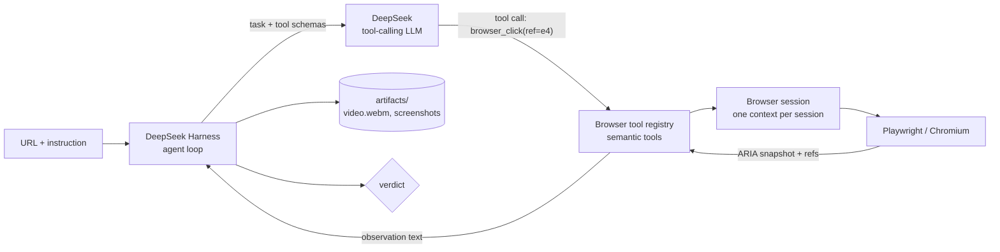

# Web Test Agent (MVP)

**Give it a URL and a plain-English instruction. It drives a real browser and tells you PASS or FAIL — with evidence you can watch.**

```
URL + instruction  →  agent loop  →  Playwright browser  →  PASS / FAIL + video + screenshots
```

This repo ships the **browser half** of that loop as a DeepSeek Harness bundle. The agent
loop, session store, LLM transport and Web UI are the harness's; this repo owns
everything below the tool boundary. It is deliberately narrow: one instruction in, one
trustworthy verdict out.

---

## The one thing this MVP has to get right

> A DeepSeek Harness agent can receive a URL + natural-language instruction and autonomously complete a 5–10 step workflow on a real website using Playwright, with a trustworthy PASS/FAIL result and recorded evidence.

Everything below exists to serve that sentence.

---

## Quick start

```bash
npm install
npx playwright install chromium
```

### As a DeepSeek Harness plugin

The agent loop, session store, LLM transport, retry, tool registry and Web UI all
belong to DeepSeek Harness. This repo contributes the browser as a bundle that
installs into a DSH profile, where the harness owns the loop:

```bash
npm run build:plugin
npm run install:plugin           # packs and installs into the headless + web profiles
npx @deepseek-ai/dsh@0.1.5-rc.2 --profile headless "Sign in at http://127.0.0.1:3000/demo/ and assert the Projects page appears."
```

`plugin add` needs `pnpm` on `PATH`, and `dsh` refuses to boot in a directory whose
`.env` sets `DEEPSEEK_BASE_URL` — so run it from somewhere else. See the
[plugin README](packages/dsh-browser-playwright/README.md) for the tool list,
configuration, and the cordis details the bundle depends on.

### Both profiles verified

| Path | How it was proven |
| --- | --- |
| `headless` | `--profile headless "<task>"` runs one task against the real model, prints the verdict and exits. No UI, no workspace. |
| `web` | Workspace added through the in-page directory browser, prompt sent from the chat box. 6 steps, 6s, 75.3K tokens → `ASSERTION PASSED`. |

The web profile needs one overlay to be automatable at all: its workspace picker
defaults to a **native OS folder dialog**, which lives outside the page. Appending
`--patch ./dsh/web-browse-picker.patch.yml` swaps it for the in-page tree. That file
carries the details, including the two cordis patch semantics that make it work.

---

## Architecture



The important seam is between **the agent loop** and **the browser plugin**. The loop
is DSH's; this repo owns everything below the tool boundary:

```
packages/dsh-browser-playwright/src/tools/*    → the browser plugin (what the agent may do)
packages/dsh-browser-playwright/src/internal/* → refs, snapshot, session (Playwright)
```

Nothing above the tool boundary knows about Playwright, and the plugin knows nothing about
prompts or verdicts. That is the seam the DSH bundle slots into (see
[Relationship to DeepSeek Harness](#relationship-to-deepseek-harness)).

### Two agents, on purpose

| | **Browser Agent** | **Test Agent** |
| --- | --- | --- |
| Job | Drive the page | Decide if the workflow passed |
| Sees | ARIA snapshot, refs, tool results | Instruction, action log, assertions |
| Owns | Refs, sessions, page state | Verdict, evidence, artifacts |

They are separate because "the click worked" and "the test passed" are different claims. Collapsing them is how products emit false PASSes.

---

## How the agent sees the page

The model **never** gets raw Playwright, raw HTML, or a JavaScript-evaluation tool. It gets a text snapshot with opaque element handles:

```
URL: http://localhost:3000/demo/
TITLE: Acme Demo App
REFS: generation 3, 11 interactive element(s)

INTERACTIVE ELEMENTS
[e1] textbox "Email" [testid=email-input type=email placeholder="you@example.com"]
[e2] textbox "Password" [testid=password-input type=password]
[e3] checkbox "Remember me" [testid=remember-checkbox type=checkbox unchecked]
[e4] button "Sign in" [testid=login-button]
...

PAGE OUTLINE
- heading "Sign in to Acme" [level=1]
- textbox "Email": /placeholder: you@example.com
- button "Sign in"
```

Properties:

- **Visibility first.** Visible elements are listed first with `not-visible` marked, so the agent can tell a hidden panel from an absent one.
- **Bounded.** Capped at 150 elements and 5000 outline characters, so a huge page can't blow the context window.
- **`data-testid` aware.** Test ids are surfaced and preferred when building locators.
- **Generation counter.** Every snapshot bumps a generation. Acting on a stale ref fails *with a recovery hint* listing valid refs, instead of silently clicking the wrong thing:
  ```
  ref "e4" is stale (snapshot generation 3, refs were created in generation 1).
  Take a fresh snapshot and use the current refs: e1, e2, ...
  ```

### Locator priority

`data-testid` → `getByRole(role, { name, exact })` → `getByPlaceholder` → structural CSS path.

Role + accessible name is what a real user perceives, so it survives cosmetic markup churn. Raw CSS paths are the last resort because they break on every refactor.

---

## The tools the model may call

| Tool | Purpose |
| --- | --- |
| `browser_open` | Navigate to a URL |
| `browser_snapshot` | Re-read the page and get fresh refs |
| `browser_click` | Click an element (auto-scrolls into view) |
| `browser_fill` | Type into a field |
| `browser_press` | Press a key, optionally on an element (Enter to submit) |
| `browser_select` | Choose an option in a `<select>` |
| `browser_wait` | Wait for time, text, or an element state |
| `browser_screenshot` | Capture evidence |
| `browser_assert` | **Verify a claim** — url/title contains, text present, element state |
| `browser_wait_for_human` | Park the run for a person to clear a challenge (visible-window profiles only) |

That's the whole surface. There is no `evaluate_javascript` and no generic "do anything" escape hatch — every capability is an intent a reviewer can reason about.

`browser_assert` is the load-bearing tool: it returns `ASSERTION PASSED` or `ASSERTION FAILED` and **does not throw**, so the model can retry with a better assertion instead of the run derailing. Its `presentationMeta` is what the harness surfaces as the verdict — the native `finish_test` tool was dropped in the port.

The `headless` profile is `humanInTheLoop: false`, so `browser_wait_for_human` hard-refuses there; the challenge banner tells the agent to report the run as blocked instead.

---

## Why the verdict is trustworthy

1. **A PASS requires a passed assertion.** Clicking a button is not evidence; observing the result is. `browser_assert` returns the verdict, and the harness surfaces it.
2. **Asymmetric cost of being wrong.** A false PASS is far worse than a false FAIL. A testing tool that reports green on a broken app is worse than useless — which is why **false PASS rate** stays the metric that matters most.
3. **Evidence from the first commit.** Every run records video and screenshots under the configured artifacts dir. Trust comes from being able to check, not from being asked to.
4. **Refs, not narrated work.** Acting on a stale ref fails with a recovery hint listing the valid refs, so a model cannot silently click the wrong thing after a re-render.
5. **No refusals are faked.** The tool boundary has no credential store and no CAPTCHA solver; a blocked run is reported as a blocker, not a PASS.

---

## Project layout

```
packages/
  dsh-browser-playwright/   DeepSeek Harness bundle (see its own README)
    src/index.ts              bundle entry: ctx.browser + the tool fiber
    src/playwright.ts         Playwright provider behind ctx.browser
    src/config.ts             Row config → resolved options
    src/service.ts            The ctx.browser contract (Temporal-free types)
    src/tool.ts               defineTool helper for the browser_* tools
    src/internal/             refs, snapshot, session
    src/tools/                observe, interact, assert
    test/e2e.mjs              Offline checks + a real Chromium login flow
    cordis.patch.yml          The one row this bundle inserts
dsh/
  web-browse-picker.patch.yml  Overlay that makes the DSH web UI automatable
  human-in-the-loop.patch.yml  Overlay opening a real window for browser_wait_for_human
scripts/
  install-dsh-plugin.mjs     Build + pack + install into DSH profiles, then verify
demo-app/index.html     Acme demo app, kept as a manual target (see below)
```

Everything runnable lives in `packages/dsh-browser-playwright`. The repo root only hosts
the workspace, the patch overlays and the installer. The former native agent tree
(`src/`) — loop, LLM client, prompt, refs/snapshot prototype, HTTP server, run console and
benchmark — has been removed; its content is recoverable from git history.

---

## The interface

The run console is DeepSeek Harness's own Web UI (`--profile web`), which drives this
plugin's tools; `--profile headless` is the unattended equivalent. There is no bespoke
server or UI in this repo any more.

---

## The demo app

`demo-app/index.html` is a small app with deliberately realistic failure modes, so a run can test *rejections* and not just happy paths:

- login with email validation and a wrong-credential error
- projects panel with empty-name and duplicate-name rejection
- settings panel with a persisted `<select>`
- simulated 250ms latency (so races are real)
- state in `localStorage`, isolated per run by using a fresh `BrowserContext`

It has **no search box and no delete button** — exactly the kind of check that should come back FAIL. A testing tool must be able to say "no".

It is kept as a realistic manual target. It is **not** wired to an automated runner: the
scenario corpus that used it was part of the removed native agent tree and is recoverable
from git history. Serve it with any static server, e.g.
`npx serve demo-app` — or just open the file — and point a DSH run at it.

---

## Offline validation (no API key needed)

```bash
npm run test:plugin               # the DSH bundle: offline checks + real Chromium
```

`test:plugin` needs nothing but Chromium — it builds the DSH bundle, registers its tools
against a stub harness, and drives a real Chromium through a full login flow, asserting
both the passing *and* the failing path, without a model or an API key.

---

## Benchmark

Not ported. The native loop, the offline drivers and the benchmark harness were all
removed with `src/`; the 8-scenario corpus (6 pass, 2 negative) is recoverable from git
history. The metric that matters most is unchanged — **false PASS rate**, a PASS on a
scenario that should FAIL. Re-pointing a benchmark at `dsh --profile headless` is open
work (see [Roadmap](#roadmap)).

---

## Design decisions worth defending

**Refs are invalidated on every mutation.** Convenient? No. Correct? Yes — otherwise the agent clicks a stale node after a re-render and the verdict is quietly wrong.

**One `BrowserContext` per session.** Isolated cookies, storage, and cache, so runs can't contaminate each other. (`persistent: true` deliberately trades that isolation for one shared on-disk profile — see the plugin README.)

**Video from day one.** It is the single most persuasive piece of evidence and it is nearly free (`recordVideo` on the context). Runs are also the only way to debug an agent flake after the fact.

**`page.evaluate()` functions need a `__name` polyfill.** esbuild/tsc can rewrite every function they compile with a `__name(fn, "x")` keepNames helper; Playwright serialises the function *source* into the browser, where that helper doesn't exist, so `page.evaluate()` dies with `ReferenceError: __name is not defined`. The plugin registers `globalThis.__name ||= (fn) => fn` at profile-launch time (`INIT_SCRIPT_POLYFILL`), which makes transpiled evaluate code work in dev *and* in a build. Don't remove it — every `page.evaluate` in the package depends on it.

**Never swallow observation errors.** An early `.catch(() => [])` in the snapshot collector turned "the entire element collector is broken" into "this page has no elements". Observation failures must be loud.

---

## Known limitations

Honest list, because an MVP that pretends otherwise is a liability:

- **No self-healing.** A changed `data-testid` will fail the run; the agent may recover by re-snapshotting, or may not.
- **Login is hard-coded in the instruction.** Credentials are passed as text in the prompt — there is no credential store, and none should exist until there's a secure one.
- **CAPTCHAs, MFA, and anti-bot walls stop the agent.** By design; it reports the blocker instead of trying to defeat it.
- **Iframes and new tabs are not handled.** Ref collection inspects the main frame only.
- **The 150-element cap** can hide what the agent needs on very dense pages.
- **No CI integration.** `dsh --profile headless` exits with a usable status code, but there is no GitHub Action, no test-code generation, no scheduling.
- **Cost is unmanaged.** No budget cap or token accounting beyond reporting usage per run.

---

## Relationship to DeepSeek Harness

The brief was to build a thin browser layer on top of DeepSeek Harness. An earlier MVP implemented the loop natively against the DeepSeek chat API, to prove the Playwright foundation, the snapshot engine and the actions *before* letting a model drive them. That native loop has since been removed; what remains is the browser layer, shipped as a **real DSH bundle** in [`packages/dsh-browser-playwright`](packages/dsh-browser-playwright/README.md). The refs, snapshot engine and locator strategy are exposed as ten `defineTool` tools behind a `ctx.browser` service:

```
~/.dsh/profiles/<profile>/dsh.profile.bundles
  → @webtestagent/dsh-browser-playwright
      → cordis.patch.yml            inserts one row
          → browser-playwright      mounts ctx.browser (Playwright provider)
              → browser-tools       registers the ten browser_* tools
```

**The harness needs no changes.** It supplies the agent loop, session store, LLM transport, retry, tool registry and UI; this package supplies only the browser. Verified against DSH `0.1.5-rc.2` — offline checks against a stub harness and real Chromium, then real agent runs in *both* the `headless` and `web` profiles that signed into the demo app and returned a PASS with assertion evidence.

| Concern | Owner |
| --- | --- |
| Agent loop, session store, LLM transport, retry, tool registry, Web UI | DSH |
| Prompt + verdict presentation | DSH (`presentationMeta` on assertions) |
| Browser session, refs, snapshot engine, locator strategy | this package |
| Tools | this package — 10 `browser_*` (incl. `browser_wait_for_human`; there is no `finish_test`) |
| Evidence artifacts | screenshots + `.webm` video under the configured dir |

The design carried over from the native prototype: refs over selectors, visibility-first bounded snapshots, generation-based invalidation, and an assertion that **returns a verdict instead of throwing**. The port also fixed two real gaps that only surfaced once a model was driving — `browser_assert` gained a `selector` target for non-interactive elements, and `ref` + `selector` together became an explicit hard error.

---

## Roadmap

| Phase | Deliverable | Status |
| --- | --- | --- |
| 0 | Workspace, TypeScript setup, env config | ✅ |
| 1 | Playwright foundation — session, screenshots, video | ✅ → in the DSH bundle |
| 2 | Snapshot engine — element collection, refs, invalidation | ✅ → in the DSH bundle |
| 3 | Action tools — click, fill, select, press, wait, assert | ✅ → in the DSH bundle |
| 4 | Test runner — prompt, loop, verification, artifacts | ❌ removed; the harness owns the loop |
| 5 | Demo app + 8 scenarios (incl. 2 negative) | 🟡 `demo-app/` kept; the 8 scenarios were removed with the native tree (git history) |
| 6 | UI + SSE API + artifact browsing | ❌ removed; the harness's own Web UI replaces it |
| 7 | Benchmark — success rate + **false PASS rate** | ❌ removed; not ported |
| 8 | End-to-end DeepSeek run | ✅ via the DSH plugin — see below |
| 9 | DSH bundle — 10 tools, installable into a profile | ✅ `headless` + `web` |
| 10 | Saved test suites — replay a name, not a prompt | ⬜ |
| 11 | CI — exit codes, GitHub Action, regression history | ⬜ |

Phase 8 moved to the harness: `--profile headless "<task>"` runs one task against the
real model, prints the result and exits, which is a far better verification vehicle
than a bespoke loop. The native runner and its offline `smoke`/`dry-run` drivers were
therefore removed.

---

## Explicitly out of scope for this MVP

Kept out on purpose, to protect the one milestone:

GitHub/PR integration · CI/CD pipelines · generated test code repos · multi-user auth or SaaS · distributed browser grids · raw CDP access · autonomous credential discovery · visual/screenshot reasoning.

Each is a way to spend the MVP's budget on something other than a trustworthy verdict.
