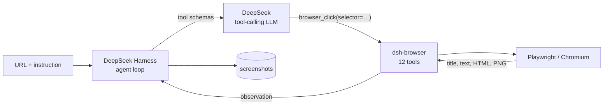

# WebTestAgent

**Point a DeepSeek Harness agent at a URL with a plain-English instruction; it drives a real
browser and reports back.**

This repo is the thin host layer for agentic web testing on top of
[DeepSeek Harness](https://www.npmjs.com/package/@deepseek-ai/dsh). It ships no browser code
of its own: the browser is the third-party **`dsh-browser`** bundle, wired into DSH profiles.
What this repo owns is the configuration around it, the one piece of tooling `dsh-browser`
cannot provide for itself, and a demo app worth pointing a run at.



> **The browser plugin this repo used to ship was retired.** See
> [Why the plugin was retired](#why-the-plugin-was-retired). The short version: it could not
> coexist with `dsh-browser`, so one had to go, and `dsh-browser` won.

---

## What's here

| Path | What it is |
| --- | --- |
| `dsh/web-browse-picker.patch.yml` | Overlay that makes the DSH web UI's workspace picker automatable. Without it, the picker is a **native OS dialog** — outside the page, so no browser automation can see or dismiss it, which makes the whole web UI untestable end to end. |
| `scripts/patch-dsh-browser-headed.mjs` | Makes `dsh-browser` open a **visible** Chromium window, per profile. It hardcodes `headless: true` and exposes no config key, so patching the installed source is the only route short of forking. |
| `demo-app/index.html` | A small Acme app with deliberately realistic failure modes, so a run can be tested against *rejections* and not only happy paths. |

---

## Quick start

```bash
npm install
npm run serve:demo          # demo app on http://127.0.0.1:4173/
```

Then, **from a different directory**, run a task:

```bash
DEEPSEEK_API_KEY=$(grep -m1 '^DEEPSEEK_API_KEY=' /path/to/this/repo/.env | cut -d= -f2-) \
  dsh --profile headless "Open http://127.0.0.1:4173/ and tell me the exact page title."
```

Two things that will bite you otherwise:

- **`dsh` refuses to boot in a directory whose `.env` sets `DEEPSEEK_BASE_URL`.** It is an
  anti-hijack fence, and this repo is exactly such a directory. `cd /tmp` first.
- **`dsh plugin …` shells out to a bare `dsh` and a bare `pnpm`.** Both must be on `PATH`, or
  you get `sh: dsh: command not found` from what looks like a working command.

---

## The profiles

Profiles live in `~/.dsh/profiles/<name>/`. On this machine:

| Profile | Bundles | Browser |
| --- | --- | --- |
| `headless` | `dsh-base`, `dsh-headless`, `dsh-browser` | headless (stock) |
| `web` | `dsh-base`, `dsh-web-app`, `dsh-browser` | **headed**, via the patcher below |

Both profile patch layers (`~/.dsh/profiles/<name>/cordis.patch.yml`) are intentionally empty:

```yaml
[]
```

Keep it an explicit `[]`. A comments-only patch layer parses as `null`, and dsh then refuses to
boot with `overlay … must be a top-level YAML array of loader patch entries`.

Manage the browser bundle with:

```bash
dsh plugin --profile headless add dsh-browser
dsh plugin --profile headless remove dsh-browser
```

---

## The tools the model may call

All twelve come from `dsh-browser`, and every selector-taking tool wants **CSS**, not a
semantic locator.

| Tool | Does |
| --- | --- |
| `browser_open` | Open (or reuse) the browser, optionally navigating to a URL. Returns title + URL. |
| `browser_navigate` | Navigate the current page to a URL and wait for load. |
| `browser_click` | Click the element matching a CSS selector. |
| `browser_type` | Type into an input matching a CSS selector; optionally press Enter. |
| `browser_select` | Select option value(s) in a `<select>`. |
| `browser_get_text` | Visible text of the first match, or the whole body. |
| `browser_get_html` | Outer HTML of the first match, or the whole document (default cap 20000 chars). |
| `browser_eval` | Evaluate a JavaScript expression in the page, JSON-serialised. |
| `browser_wait` | Wait **milliseconds** (1–60000). That is all it does. |
| `browser_screenshot` | PNG, by default `<workspace>/browser-screenshots/<timestamp>.png`; view it with `read_image`. |
| `browser_install` | Explain or attempt `npx playwright install chromium` after a launch failure. |
| `browser_close` | Close the browser and release resources. |

Three sharp edges worth knowing before you debug a confusing run:

- **`browser_eval` takes an expression, not a function body** — its description claims both,
  and that is wrong. It compiles `Function('"use strict"; return (' + expression + ')')()`, so
  a bare arrow function evaluates to the function object, which serialises to `null`.
- **`browser_wait` cannot wait for anything but time.** There is no "wait for text" or "wait
  for element state", so polling a slow page means guessing a duration.
- **Screenshots default into `<workspace>/browser-screenshots/`**, which litters whatever
  workspace a run is pointed at.

---

## Headed browsers

`dsh-browser` hardcodes `headless: true` (`lib/browser-manager.js`) and its config schema has no
`headless` key, so neither its own `cordis.patch.yml` nor a `--patch` overlay can reach it. The
`web` profile is the attended one — a visible window is the entire point of it — so this repo
patches the installed file:

```bash
npm run patch:headed -- --profile web --verify    # apply, then prove a window opened
npm run patch:headed -- --profile web --revert    # back to stock headless
DSH_BROWSER_HEADED=0 dsh --profile web "…"        # or just headless for one run
```

`--verify` launches through the patched manager and diffs `ps` before/after, inspecting **only
the processes it caused to appear** — a machine with Chrome already open would otherwise make
the check pass or fail for reasons that have nothing to do with the patch. Only the main
process carries `--headless`, so it asserts "none of ours", never "all of ours".

> **Any `pnpm install` in a profile silently reverts this**, including `dsh plugin add/remove`,
> because it restores the pristine registry copy. Re-run the patcher afterwards — it is
> idempotent, and it fails loudly if upstream's code changed shape rather than patching blindly.

---

## The demo app

`demo-app/index.html` — a small Acme app with deliberately realistic failure modes:

- login with email validation and a wrong-credential error
- projects panel with empty-name and duplicate-name rejection
- settings panel with a persisted `<select>`
- simulated 250 ms latency, so races are real
- state in `localStorage`

It has **no search box and no delete button** — exactly the kind of claim that should come back
negative. A testing tool that cannot say "not found" is not testing anything.

---

## Driving the DSH web UI

`--profile web` serves the harness's own Web UI. Its "add workspace" flow defaults to that
native OS folder dialog, so append the overlay:

```bash
dsh --profile web --patch /absolute/path/to/dsh/web-browse-picker.patch.yml --no-open --port 3099
```

Use an **absolute** path — `--patch` is resolved against the shell's working directory. The
file itself documents the two cordis patch semantics it depends on: `name` on a non-insert
patch is a *guard*, not a setter, and a row cannot be re-pointed at another module, so the
native picker is disabled and the in-page picker inserted under new ids.

---

## Why the plugin was retired

This repo used to ship `@webtestagent/dsh-browser-playwright`: ten tools, ARIA snapshots with
stable element refs, generation-based ref invalidation, `browser_assert`, one `BrowserContext`
per run, challenge detection, and a human-in-the-loop handoff. `dsh-browser` offered a wider
tool surface — `browser_eval`, `browser_get_text`, `browser_get_html` — so the two were
compared head to head and the swap was made.

They **cannot coexist**, and the reason is worth recording, because the obvious compromise —
"mount both and delete the overlapping tools" — does not work:

1. **Duplicate tool names are fatal, not last-wins.** Five collided: `browser_open`,
   `browser_click`, `browser_select`, `browser_screenshot`, `browser_wait`. In
   `@deepseek-ai/dsh-scope`, `NamedEntries.insert()` is
   `if (data.has(name)) throw this.duplicateError(name)`. Mounting both made *all* of the old
   plugin's tools vanish — not merely the five that collided — while the boot still exited `0`
   with **no error text anywhere**. A silent failure with a plausible-looking success.

2. **Each plugin owned its own Chromium.** Ours launched one
   (`chromium.launch()` / `chromium.launchPersistentContext`); `dsh-browser` launches its own,
   with its own page. So even with the name collision avoided, a surviving `browser_snapshot`
   would have read *our* blank page while `browser_click` drove *theirs* — split brain, and
   worse than either plugin alone because the results look plausible. The tool sets are not
   interchangeable across that boundary; one engine has to own all of them.

Hence all-or-nothing per profile, and `dsh-browser` won.

---

## What this cost

Honest list. The swap bought three tools and gave up more than three:

| Lost | Consequence |
| --- | --- |
| `browser_assert` | **The biggest loss.** Nothing returns a verdict any more, so no step is a machine-checkable PASS/FAIL. The agent reports what it observed; a human decides. |
| ARIA snapshots + refs | Tools take CSS selectors again. A changed `data-testid` or an unannounced re-render can silently retarget a click. |
| Per-session isolation | `dsh-browser` is a singleton browser with a single `currentPage`. Runs share cookies and storage, so they can contaminate each other. |
| Challenge detection | No structured "this is a bot wall" signal; a block looks like any other failure. |
| `browser_wait_for_human` + `humanInTheLoop` | **The `web` profile's entire human-in-the-loop story is gone.** A person can still watch and click the visible window, but the agent can no longer hand off to them or park a run. This is inherent to `dsh-browser`, not patchable around. |
| Rich `browser_wait` | Time-only now; no waiting on text or element state. |
| Recorded video | No `recordVideo`; screenshots only, into `<workspace>/browser-screenshots/`. |

The retired plugin is recoverable from git history — `75f5cf9` is the v0.4.0 commit — as is the
native agent tree that preceded it.

---

## Verified against

DSH `0.1.5-rc.2`, `dsh-browser` `0.1.0`, Node 24, macOS. The `headless` profile was checked end
to end rather than by config dump: twelve `browser_*` tools present, and `browser_open` against
the demo app returning its real title. The headed patch was verified by the `ps` diff described
above: 9 processes spawned, 0 carrying `--headless`.
