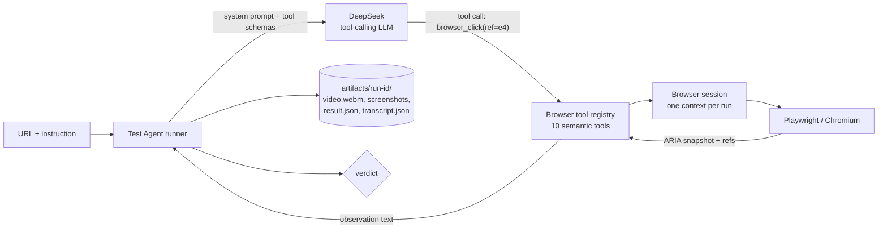

# Web Test Agent (MVP)

**Give it a URL and a plain-English instruction. It drives a real browser and tells you PASS or FAIL — with evidence you can watch.**

```
URL + instruction  →  agent loop  →  Playwright browser  →  PASS / FAIL + video + screenshots
```

This repo is a working MVP of that loop. It is deliberately narrow: one instruction in, one trustworthy verdict out.

---

## The one thing this MVP has to get right

> A DeepSeek Harness agent can receive a URL + natural-language instruction and autonomously complete a 5–10 step workflow on a real website using Playwright, with a trustworthy PASS/FAIL result and recorded evidence.

Everything below exists to serve that sentence.

---

## Quick start

```bash
npm install
npx playwright install chromium

cp .env.example .env
# edit .env and set DEEPSEEK_API_KEY=sk-...

npm run dev          # UI + demo app on http://localhost:3000
```

Then open <http://localhost:3000>, click a scenario chip, and press **Run test**.

### CLI

```bash
npm run agent -- \
  --url http://localhost:3000/demo/ \
  --instruction "Log in as test@example.com / password123, create a project called 'AI Test', and verify that it appears in the list."
```

| Flag | Meaning |
| --- | --- |
| `--url <url>` | Target URL (required) |
| `--instruction <text>` | What to test, in plain English (required) |
| `--headed` | Show the browser window |
| `--steps <n>` | Max agent steps (default 40) |
| `--no-video` | Disable video recording |

Exit code is `0` on PASS, `1` on FAIL/error — so it drops straight into CI later.

### As a DeepSeek Harness plugin

The same browser layer installs into a DSH profile, where the harness owns the loop:

```bash
npm run build:plugin
npm run install:plugin           # packs and installs into the headless + web profiles
npx @deepseek-ai/dsh@0.1.5-rc.2 --profile headless "Sign in at http://127.0.0.1:3000/demo/ and assert the Projects page appears."
```

`plugin add` needs `pnpm` on `PATH`, and `dsh` refuses to boot in a directory whose
`.env` sets `DEEPSEEK_BASE_URL` — so run it from somewhere else. See the
[plugin README](packages/dsh-browser-playwright/README.md) for the tool list,
configuration, and the cordis details the bundle depends on.

### Both profiles verified

| Path | How it was proven |
| --- | --- |
| `headless` | `--profile headless "<task>"` runs one task against the real model, prints the verdict and exits. No UI, no workspace. |
| `web` | Workspace added through the in-page directory browser, prompt sent from the chat box. 6 steps, 6s, 75.3K tokens → `ASSERTION PASSED`. |

The web profile needs one overlay to be automatable at all: its workspace picker
defaults to a **native OS folder dialog**, which lives outside the page. Appending
`--patch ./dsh/web-browse-picker.patch.yml` swaps it for the in-page tree. That file
carries the details, including the two cordis patch semantics that make it work.

---

## Architecture



The important seam is between **the agent loop** and **the browser plugin**:

```
src/agent/runner.ts   → the loop (prompt, tool dispatch, verification, artifacts)
src/tools/*           → the browser plugin (what the agent is allowed to do)
src/agent/llm.ts      → the model transport (OpenAI-compatible /chat/completions)
```

Nothing above `src/browser/` knows about Playwright, and nothing below `src/agent/` knows about prompts. That is the boundary a DeepSeek Harness integration would slot into (see [Relationship to DeepSeek Harness](#relationship-to-deepseek-harness)).

### Two agents, on purpose

| | **Browser Agent** | **Test Agent** |
| --- | --- | --- |
| Job | Drive the page | Decide if the workflow passed |
| Sees | ARIA snapshot, refs, tool results | Instruction, action log, assertions |
| Owns | Refs, sessions, page state | Verdict, evidence, artifacts |

They are separate because "the click worked" and "the test passed" are different claims. Collapsing them is how products emit false PASSes.

---

## How the agent sees the page

The model **never** gets raw Playwright, raw HTML, or a JavaScript-evaluation tool. It gets a text snapshot with opaque element handles:

```
URL: http://localhost:3000/demo/
TITLE: Acme Demo App
REFS: generation 3, 11 interactive element(s)

INTERACTIVE ELEMENTS
[e1] textbox "Email" [testid=email-input type=email placeholder="you@example.com"]
[e2] textbox "Password" [testid=password-input type=password]
[e3] checkbox "Remember me" [testid=remember-checkbox type=checkbox unchecked]
[e4] button "Sign in" [testid=login-button]
...

PAGE OUTLINE
- heading "Sign in to Acme" [level=1]
- textbox "Email": /placeholder: you@example.com
- button "Sign in"
```

Properties:

- **Visibility first.** Visible elements are listed first with `not-visible` marked, so the agent can tell a hidden panel from an absent one.
- **Bounded.** Capped at 150 elements and 5000 outline characters, so a huge page can't blow the context window.
- **`data-testid` aware.** Test ids are surfaced and preferred when building locators.
- **Generation counter.** Every snapshot bumps a generation. Acting on a stale ref fails *with a recovery hint* listing valid refs, instead of silently clicking the wrong thing:
  ```
  ref "e4" is stale (snapshot generation 3, refs were created in generation 1).
  Take a fresh snapshot and use the current refs: e1, e2, ...
  ```

### Locator priority

`data-testid` → `getByRole(role, { name, exact })` → `getByPlaceholder` → structural CSS path.

Role + accessible name is what a real user perceives, so it survives cosmetic markup churn. Raw CSS paths are the last resort because they break on every refactor.

---

## The 10 tools the model may call

| Tool | Purpose |
| --- | --- |
| `browser_open` | Navigate to a URL |
| `browser_snapshot` | Re-read the page and get fresh refs |
| `browser_click` | Click an element (auto-scrolls into view) |
| `browser_fill` | Type into a field |
| `browser_press` | Press a key, optionally on an element (Enter to submit) |
| `browser_select` | Choose an option in a `<select>` |
| `browser_wait` | Wait for time, text, or an element state |
| `browser_screenshot` | Capture evidence |
| `browser_assert` | **Verify a claim** — url/title contains, text present, element state |
| `finish_test` | Declare PASS/FAIL with a summary and the steps performed |

That's the whole surface. There is no `evaluate_javascript` and no generic "do anything" escape hatch — every capability is an intent a reviewer can reason about.

`browser_assert` is the load-bearing tool: it returns `ASSERTION PASSED` or `ASSERTION FAILED` and **does not throw**, so the model can retry with a better assertion instead of the run derailing.

---

## Why the verdict is trustworthy

1. **A PASS requires a passed assertion.** The system prompt states: *"Never report PASS because an action succeeded."* Clicking a button is not evidence; observing the result is.
2. **Asymmetric cost of being wrong.** The prompt states: *"A false PASS is far worse than a false FAIL."* A testing tool that reports green on a broken app is worse than useless — the benchmark therefore tracks **false PASS rate** as its headline metric.
3. **Evidence from the first commit.** Every run records video, screenshots, the action log, and the full LLM transcript. Trust comes from being able to check, not from being asked to.
4. **The action log and the transcript are separate files.** The report describes what the browser *did* (`result.json` keyed off `TestAction[]`); the transcript records what the model *said*. They can be diffed to catch a model narrating work it never performed.
5. **No verdict is an error, not a pass.** Hitting the step limit yields `error: "agent did not reach a verdict within N steps"` — never a silent PASS.
6. **No refusals are faked.** The prompt forbids bypassing CAPTCHAs, logins, or anti-bot measures; the agent fails the test and says so.

---

## Project layout

```
packages/
  dsh-browser-playwright/   DeepSeek Harness bundle (see its own README)
    src/index.ts              bundle entry: ctx.browser + the tool fiber
    src/playwright.ts         Playwright provider behind ctx.browser
    src/config.ts             Row config → resolved options
    src/service.ts            The ctx.browser contract (Temporal-free types)
    src/tool.ts               defineTool helper for the browser_* tools
    src/internal/             refs, snapshot, session (ported from src/browser)
    src/tools/                observe, interact, assert
    cordis.patch.yml          The one row this bundle inserts
dsh/
  web-browse-picker.patch.yml  Overlay that makes the DSH web UI automatable
scripts/
  install-dsh-plugin.mjs     Build + pack + install into DSH profiles, then verify
src/
  index.ts              CLI entry point
  server.ts             Express: UI + demo app + artifacts + JSON/SSE API
  config.ts             Env-driven configuration
  scenarios.ts          8 built-in test scenarios (6 pass, 2 negative)
  bench.ts              Benchmark harness (success + false PASS rate)
  smoke.ts              Browser-only smoke test (no LLM required)
  dry-run.ts            Scripted tool-layer test (no LLM required)
  agent/
    prompt.ts           System prompt + prose-verdict fallback parser
    llm.ts              Chat/message types + OpenAI-compatible client
    runner.ts           The agent loop, verification, artifact persistence
  browser/
    session.ts          BrowserContext lifecycle, video, init scripts
    snapshot.ts         Element collection, refs, locator building
    refs.ts             RefStore with generation-based invalidation
  test-run/
    artifacts.ts        Run directories, ids, paths, one-line summarizer
    recorder.ts         Action log, assertions, artifact registration
  tools/
    index.ts            Registry → tool schemas for the LLM
    context.ts          ToolContext + ToolDefinition
    open|snapshot|click|fill|press|select|wait|screenshot|assert|finish.ts
  ui/index.html         Single-page run console (no build step)
demo-app/index.html     Acme demo app used by the scenarios
artifacts/<run-id>/     video.webm, screenshots/, result.json, transcript.json
```

---

## The interface

`npm run dev` serves:

| Route | Purpose |
| --- | --- |
| `/` | Run console — instructions, scenarios, live log, evidence |
| `/demo/` | The Acme demo app the scenarios target |
| `/artifacts/*` | Recorded evidence, browsable straight from the UI |
| `GET /api/health` | Model, whether the API key is configured, artifacts dir |
| `GET /api/scenarios` | Built-in scenarios |
| `POST /api/runs` | Start a run → `202 { id, eventsUrl }` |
| `GET /api/runs/:id/events` | **Server-sent events** — live action log, replayed on reconnect |
| `GET /api/runs/:id` | One run |
| `GET /api/runs` | Recent runs (in-memory + disk scan) |

The UI subscribes over SSE, so the log streams in as the browser works: `✓ browser_click e4 (312ms)` appears the moment it happens. Watching the evidence arrive is what makes the verdict believable.

---

## The demo app

`demo-app/index.html` is a small app with deliberately realistic failure modes, so scenarios can test *rejections* and not just happy paths:

- login with email validation and a wrong-credential error
- projects panel with empty-name and duplicate-name rejection
- settings panel with a persisted `<select>`
- simulated 250ms latency (so races are real)
- state in `localStorage`, isolated per run by using a fresh `BrowserContext`

It has **no search box and no delete button** — which is exactly why two scenarios assert FAIL. A testing tool must be able to say "no".

---

## Offline validation (no API key needed)

```bash
npm run dev                       # in one terminal
npm run smoke                     # snapshot engine: does it find elements?
npm run dry-run                   # full tool layer: click/fill/assert with refs
npm run dry-run -- --headed       # watch it happen
npm run test:plugin               # the DSH bundle: 28 checks, real Chromium
```

The first three need `npm run dev` running. `test:plugin` does not — it builds the
DSH bundle, registers its nine tools against a stub harness, and drives a real
Chromium through a full login flow, asserting both the passing *and* the failing
path, without a model or an API key.

`dry-run` scripts a login + create-project flow through the *same* tool registry and recorder the LLM uses, resolving refs from fresh snapshots the way the model must. It exercises everything except reasoning:

```
[1/8]  ok  Open demo app              http://localhost:3000/demo/
[2/8]  ok  Fill email                 e1 = "test@example.com"
[4/8]  ok  Sign in                    e4
[7/8]  ok  Verify project appears     AI Test

PASSED in 1.5s — 8/8 actions ok — 2 artifacts
```

If `dry-run` passes, any failing agent run is a *reasoning* failure, not a broken browser. That separation is what makes debugging cheap.

---

## Benchmark

```bash
npm run dev
npm run bench                      # all scenarios
npm run bench -- --only "Login"    # one scenario
```

Reports, per the MVP's own success criteria:

- **task success rate** — PASS on scenarios that should PASS
- **false PASS rate** — PASS on scenarios that should FAIL ← the metric that matters most
- **false FAIL rate** — FAIL on scenarios that should PASS
- average actions and duration, total tokens

Results are written to `bench-<timestamp>.json`.

---

## Design decisions worth defending

**Refs are invalidated on every mutation.** Convenient? No. Correct? Yes — otherwise the agent clicks a stale node after a re-render and the verdict is quietly wrong.

**One `BrowserContext` per run.** Isolated cookies, storage, and cache. Runs can't contaminate each other, and the demo app's `localStorage` state resets for free.

**Video from day one.** It is the single most persuasive piece of evidence and it is nearly free (`recordVideo` on the context). Runs are also the only way to debug an agent flake after the fact.

**`page.evaluate()` functions need a `__name` polyfill.** tsx/esbuild rewrites every function it compiles with a `__name(fn, "x")` keepNames helper; Playwright serialises the function source into the browser where that helper doesn't exist, so `page.evaluate()` dies with `ReferenceError: __name is not defined`. `BrowserSession` registers `globalThis.__name ||= (fn) => fn` via `addInitScript`, which makes transpiled evaluate code work in dev *and* in a build. Don't remove it.

**Never swallow observation errors.** An early `.catch(() => [])` in the snapshot collector turned "the entire element collector is broken" into "this page has no elements". Observation failures must be loud.

**Temperature 0.** Test verdicts must be reproducible.

---

## Known limitations

Honest list, because an MVP that pretends otherwise is a liability:

- **No self-healing.** A changed `data-testid` will fail the run; the agent may recover by re-snapshotting, or may not.
- **Login is hard-coded in the instruction.** Credentials are passed as text in the prompt — there is no credential store, and none should exist until there's a secure one.
- **CAPTCHAs, MFA, and anti-bot walls stop the agent.** By design; it reports the blocker instead of trying to defeat it.
- **Iframes and new tabs are not handled.** Ref collection inspects the main frame only.
- **Single session, in-memory orchestration.** Run state lives in one process; a restart forgets in-flight runs (finished ones are still on disk).
- **The 150-element cap** can hide what the agent needs on very dense pages.
- **No CI integration.** The CLI exits with a usable status code, but there is no GitHub Action, no test-code generation, no scheduling.
- **Cost is unmanaged.** No budget cap or token accounting beyond reporting usage per run.

---

## Relationship to DeepSeek Harness

The brief was to build a thin browser layer on top of DeepSeek Harness. The MVP first implemented the loop natively against the DeepSeek chat API — the plan was to prove the Playwright foundation, the snapshot engine and the actions *before* letting a model drive them, which is why `smoke` and `dry-run` exist and need no API key.

The browser layer is now also shipped as a **real DSH bundle**, in [`packages/dsh-browser-playwright`](packages/dsh-browser-playwright/README.md). The same refs, snapshot engine and locator strategy are re-exposed as nine `defineTool` tools behind a `ctx.browser` service:

```
~/.dsh/profiles/<profile>/dsh.profile.bundles
  → @webtestagent/dsh-browser-playwright
      → cordis.patch.yml            inserts one row
          → browser-playwright      mounts ctx.browser (Playwright provider)
              → browser-tools       registers the nine browser_* tools
```

**The harness needs no changes.** It supplies the agent loop, session store, LLM transport, retry, tool registry and UI; this package supplies only the browser. Both halves were verified against DSH `0.1.5-rc.2` — 28 offline checks, then real agent runs in *both* the `headless` and `web` profiles that signed into the demo app and returned a PASS with assertion evidence.

| | Native MVP (this repo's `src/`) | DSH plugin (`packages/dsh-browser-playwright/`) |
| --- | --- | --- |
| Agent loop | `src/agent/runner.ts` | DSH's |
| LLM transport | `src/agent/llm.ts` | DSH's |
| Prompt / verification | `src/agent/prompt.ts` | DSH's, plus `presentationMeta` on assertions |
| Browser + refs + snapshot | `src/browser/*` | re-implemented for the cordis service boundary |
| Tools | 10 (incl. `finish_test`) | 9 (`finish_test` dropped; `presentationMeta` carries the verdict) |
| Artifacts | `artifacts/<run-id>/` | screenshots + video under the configured dir |

What the two share is the design, not the code: refs over selectors, visibility-first bounded snapshots, generation-based invalidation, and an assertion that **returns a verdict instead of throwing**. The port also fixed two real gaps that only surfaced once a model was driving — `browser_assert` gained a `selector` target for non-interactive elements, and `ref` + `selector` together became an explicit hard error.

Everything under `src/browser/` and `src/tools/` remains harness-agnostic and tested without a model, which is what made the port cheap.

---

## Roadmap

| Phase | Deliverable | Status |
| --- | --- | --- |
| 0 | Workspace, TypeScript setup, env config | ✅ |
| 1 | Playwright foundation — session, screenshots, video | ✅ |
| 2 | Snapshot engine — element collection, refs, invalidation | ✅ |
| 3 | Action tools — click, fill, select, press, wait, assert | ✅ |
| 4 | Test runner — prompt, loop, verification, artifacts | ✅ |
| 5 | Demo app + 8 scenarios (incl. 2 negative) | ✅ |
| 6 | UI + SSE API + artifact browsing | ✅ |
| 7 | Benchmark — success rate + **false PASS rate** | ✅ |
| 8 | End-to-end DeepSeek run, tuned prompt | ✅ via the DSH plugin — see below |
| 9 | DSH bundle — 9 tools, installable into a profile | ✅ `headless` + `web` |
| 10 | Saved test suites — replay a name, not a prompt | ⬜ |
| 11 | CI — exit codes, GitHub Action, regression history | ⬜ |

Phase 8 moved to the harness: `--profile headless "<task>"` runs one task against the
real model, prints the result and exits, which is a far better verification vehicle
than a bespoke loop. The native runner in `src/agent/` is kept because `smoke` and
`dry-run` prove the browser layer without an API key.

---

## Explicitly out of scope for this MVP

Kept out on purpose, to protect the one milestone:

GitHub/PR integration · CI/CD pipelines · generated test code repos · multi-user auth or SaaS · distributed browser grids · raw CDP access · autonomous credential discovery · visual/screenshot reasoning.

Each is a way to spend the MVP's budget on something other than a trustworthy verdict.
